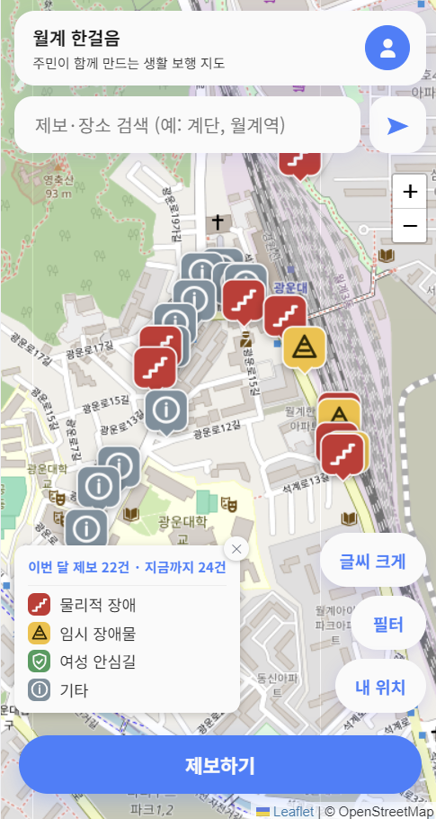

# 월계 한걸음

**골목길에도 이동의 기준이 필요합니다.**
주민이 함께 만드는 생활 보행 지도 — 2026 KW 해커톤 35조 · 월계 계섯거라



## 소개

노원구는 서울시 65세 이상 인구 3위(107,232명), 등록장애인 2위(25,361명)로 보행약자 비율이 높은 지역입니다.
그러나 일반 지도는 "거리·시간"만 알려줄 뿐, 계단·단차·좁은 보도·공사 같은 **실제로 지나갈 수 있는지**는 알려주지 않습니다.

**월계 한걸음**은 주민이 보행 불편 구간을 사진과 위치로 제보하면, 관리자 검토를 거쳐 지도에 반영되고,
다른 주민은 이동 전에 미리 확인하거나 경로찾기로 주의 구간을 안내받는 생활 보행 지도 서비스입니다.

```
주민 제보 → 관리자 검토 → 지도 반영 → 이동 전 확인
(위치·사진·유형)   (승인·반려)   (마커·상태)   (필터·경로 주의구간)
```

## 주요 기능

| 기능 | 설명 |
|---|---|
| 지도·필터 | Leaflet 기반 지도, 통행 상태·불편 유형별 마커 색상, 필터로 걸러보기 |
| 제보 등록 | 사진(최대 3장) + 위치(GPS 또는 지도에서 직접 선택) + 통행 상태 + 태그로 제보 |
| 관리자 검토 | 승인/반려/수정, 신고 처리(잘못된 정보·정보 변경), 회원 관리 |
| 경로 찾기 | TMAP 보행자 길찾기로 실제 보행로를 계산하고, 주변 승인 제보를 주의 구간으로 안내 |
| 포인트·지역 상점 | 제보 승인 시 포인트 지급, 지역 상점(데모)에서 포인트 교환 |
| 음성으로 듣기 | Web Speech API로 제보 내용을 소리로 읽어주는 배리어프리 기능 |

더 자세한 화면별 동작은 [frontend/web/README.md](frontend/web/README.md), API 명세는 [backend/API.md](backend/API.md)를 참고하세요.

## 기술 스택

- **프론트엔드**: Vanilla JS, HTML/CSS (별도 빌드 도구 없음), Leaflet + OpenStreetMap
- **백엔드**: Node.js, Express, PostgreSQL(Neon), JWT 인증, Vercel Blob(사진 저장)
- **외부 API**: TMAP 보행자 길찾기(SK Open API), Nominatim(장소 검색)
- **배포**: Vercel (서버리스 함수 + 정적 호스팅, 같은 프로젝트에서 프론트·백엔드 동시 서빙)

## 폴더 구조

```
.
├── api/            Vercel 서버리스 함수 진입점 (backend/src/index.js로 위임)
├── backend/        Express API 서버
│   ├── src/        라우트·컨트롤러·미들웨어
│   ├── migrations/ DB 스키마·마이그레이션
│   └── API.md       전체 API 명세
├── frontend/web/   주민용·관리자용 화면 (정적 파일)
└── vercel.json     배포 설정 (rewrites로 /api/* → api/index.js)
```

## 시작하기 (로컬 실행)

### 1. 환경변수 설정

```bash
cd backend
cp .env.example .env
```

`.env`를 열어 최소한 아래 값을 채웁니다.

- `DB_HOST`, `DB_PORT`, `DB_NAME`, `DB_USER`, `DB_PASSWORD` — 로컬 PostgreSQL 또는 Neon 등 클라우드 DB 접속 정보 (클라우드는 `DB_SSL=true`)
- `JWT_SECRET` — 로그인 토큰 서명용 랜덤 문자열
- `TMAP_APP_KEY` — 경로찾기를 쓰려면 필요 (없으면 다른 기능은 정상 동작, 경로찾기만 비활성화)

### 2. 설치 및 DB 마이그레이션

```bash
npm install            # backend/ 에서
npm run migrate        # 테이블 생성 + 기본 태그 데이터
```

### 3. 서버 실행

```bash
npm start               # backend/ 에서, http://localhost:3000
```

`http://localhost:3000/health`가 `{"status":"ok"}`를 돌려주면 정상입니다.

### 4. 화면 실행

```bash
npx serve -l 5500 frontend/web
```

`http://localhost:5500`을 열고 위치 권한을 허용합니다. 자세한 실행·폴더 구조는 [frontend/web/README.md](frontend/web/README.md) 참고.

## 배포

Vercel에 올리면 `frontend/web`이 정적으로 서빙되고, `/api/*` 요청은 `vercel.json`의 rewrite를 통해 `api/index.js`(Express 앱)로 전달됩니다.
Vercel 프로젝트 환경변수에 위 `.env` 항목(특히 `DB_*`, `JWT_SECRET`)을 Production 기준으로 등록해야 합니다.

## 팀

**35조 · 월계 계섯거라** — 최서린, 원미혜, 이승은, 김선아
2026 KW 해커톤
